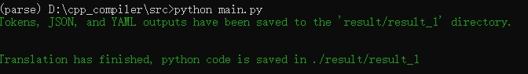
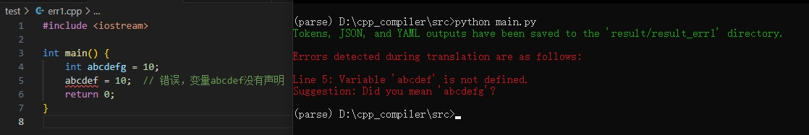
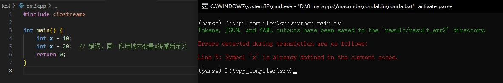
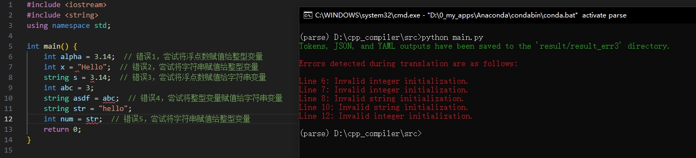
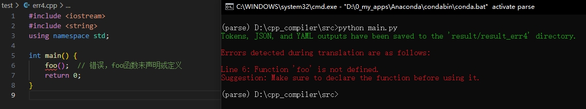
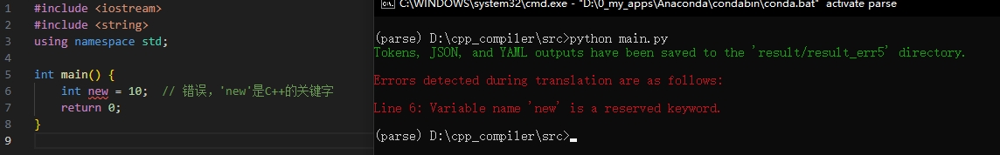
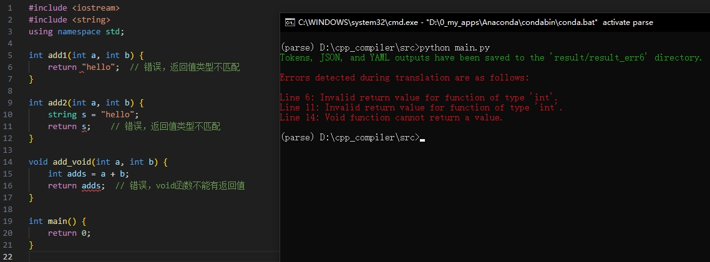
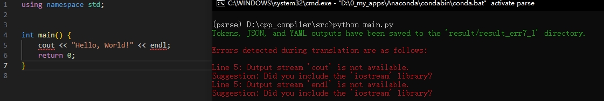
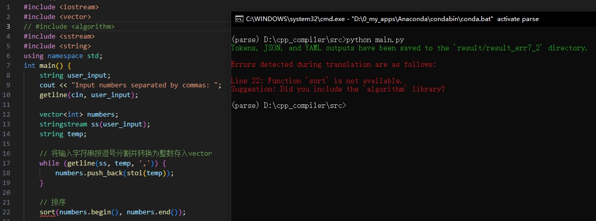

# 编译小组作业：从 C++ 到 Python 的翻译器

## 环境搭建

基于 `ANTLR 完成`，参考 `README.md` 进行环境配置以及运行程序。

## 基本功能

支持大部分 C++ 语法，实现了对 4 个测试程序（包含作业文档中的**四则运算表达式**测试程序，**难度+1**）的转换，以及基于符号表的比较**详细的错误处理**，并针对常见的 C++ 语法错误设计了**错误测试案例**。

4 个常规测试文件位于 `test` 文件夹下，`1.cpp`、`2.cpp`、`3.cpp`、`4.cpp`分别对应于**回文检测**、**排序**、**KMP 字符串匹配**、**四则运算计算**。运行 `main.py` （需要修改 `main.py` 中的 `file_symbol` 变量值以运行不同的测例），可以得到转换后的 `.py` 文件，示例如下：



我们并未设计更多的正确测试案例，而是在以上 4 个测试案例中**尽可能多的使用不同的语法**以表明翻译器的功能（连同创新点中的多种错误处理争取获得 **难度+2**）。例如，在 `1.cpp` 中，我们使用了以下两种不同的方法来输出程序的结果：

```c++
if (isPalindrome(user_input)) {
    cout << "True" << endl;
} else {
    cout << "False" << endl;
}
```

```c++
cout << (isPalindrome(user_input) ? "True" : "False") << endl;
```

## 难点

### 难点1：处理 `#include` 语句

我们的翻译器没有采用作业文档中的建议方法（将系统库文件改写为用到的函数的声明语句）来处理 `#include` 语句，而是将头文件包含的函数写入到当前符号表中，后续如果用到该系统库的类或函数，则首先查表，如果表中存在该类或函数的声明，则将其转换为对应的 Python 中的类或函数，如果表中没有，则说明 `#include` 语句缺失，我们的翻译器会给出报错并根据缺少的类或库函数提出建议。为了方便起见，我们在处理头文件（例如 `iostream`）时，仅在符号表中添加了比较常用的函数（例如 `cout`、`cin`等）。

### 难点2：符号表的设计

符号表以类的形式实现（`SymbolTable.py`），支持变量、函数、指针和数组等多种类型的符号，且通过继承进一步扩展了符号类型，便于表达更复杂的类型结构。我们的符号表支持嵌套作用域，通过 `parent` 属性可以向上层查找符号，实现了作用域链的功能。同时，我们的符号表提供了一些便捷的方法，如定义符号、初始化符号、解析符号，以及区分用户定义符号和库函数等，总体设计注重灵活性和可扩展性。

### 难点3：vector 等复杂类型变量的不同初始化方法

以 `vector` 为例，介绍我们对于多种初始化方法的处理方案：

在 C++ 中，`vector` 是一个动态数组类，常见的初始化方法包括：

1. 默认初始化：创建一个空的 `vector`，比如 `std::vector<int> v;`，此时 `v` 是空的，大小为 0。

2. 指定大小的初始化：可以指定 `vector` 的初始大小，例如 `std::vector<int> v(5);`，这会创建一个包含 5 个默认值（比如 `int` 类型是 0）的元素。

3. 指定大小和初始值：除了大小，还可以指定每个元素的初始值，比如 `std::vector<int> v(5, 10);`，这会创建一个包含 5 个值为 10 的元素的 `vector`。

在 `myVisitor` 中，我们通过获取变量声明语句前半部分的信息，得到要初始化的变量类型，然后判断 `if type_spec.startswith("vector")`，如果是 `vector`，则根据是否有参数以及参数的个数来动态决定转换策略。

## 创新点：详细错误处理

下面介绍的错误处理不包括缺少分号、括号不匹配等错误，因为这部分错误由 Lexer、Parse 处理，属于第一部分，在此不再冗余介绍。下面介绍例如变量未定义、函数返回值不正确等语法语义错误，错误测试案例位于 `test` 文件夹下，`err1-7.cpp` 分别对应下面 7 个常见 C++ 语法错误。

### 1. 变量未定义

如果使用了一个变量，则根据符号表查找，若未找到，则抛出错误并给出提示。例如，之前声明了 `abcdefg`，但是使用了 `abcdef`，我们会报错然后查找与 `abcdef` 最相似的变量名并提示 `Did you mean 'abcdefg'?`。示例图片如下：



### 2. 重复定义变量

若变量在同一个作用域内重复定义，则报错。示例图片如下：



### 3. 类型不匹配（将不同类型的值赋给变量）

在给一个变量赋值的时候，我们检查所赋内容是否与变量类型相匹配。值得注意的是，如果给新变量赋一个已经定义过的变量，我们会根据符号表查找这个变量的类型并判断是否与新变量的类型匹配。示例图片如下：



### 4. 函数调用错误

调用函数时，如果在符号表中没有查到该函数，则报错。示例图片如下：



### 5. 使用保留字作为标识符

使用保留字作为标识符，报错。示例图片如下：



### 6. 函数返回值类型不匹配

根据函数定义的返回值类型，判断实际返回的类型是否与标准返回类型相匹配。例如，`int` 函数返回 `“hello”`、`int` 函数返回一个 `string` 类型的变量、`void` 函数返回任何内容都会抛出错误。示例图片如下：



### 7. 头文件没有包含

如果没有 `include` 相关库，那么在程序中使用相关库中的类或函数会抛出错误并给出提示（`Did you include 'xxx' library`）。示例图片如下：





## 小组分工

**遍历语法树、生成目标代码**：姚远、胡天朔
**设计符号表、完成错误处理**：余毛炫堤、赵畅
